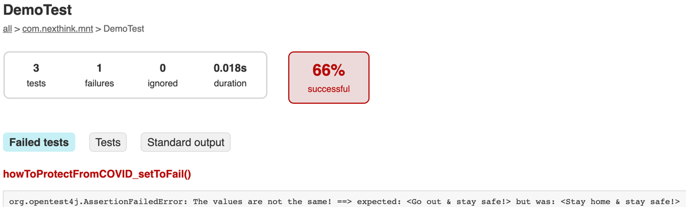
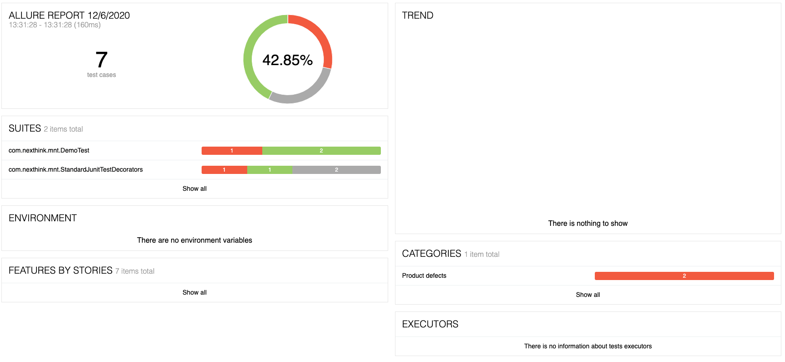
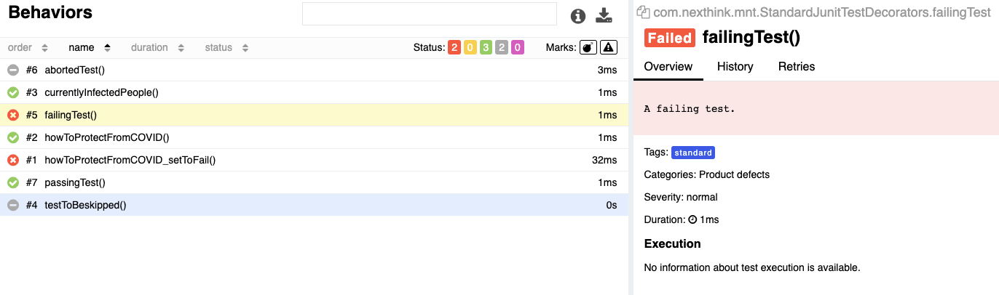

# Simple COVID calculator

This project implements a very basic "source" code to run some Junit5 tests against.  
The main idea here is HOW to setup, run and see results of junit tests.

# Installation

On macOS, use the following command to install "allure". For more info about installing it, take a look at this
link: ```https://docs.qameta.io/allure/#_get_started```

```shell
brew install allure
```

After this is done, build the project...

```shell
./gradlew clean build
```

Note:

- To get the latest ```io.qameta.allure```  version, visit this
  website: ```https://plugins.gradle.org/plugin/io.qameta.allure```

# How to run

```shell
./gradlew clean test
```

## Expected results

Expected several tests to run. Some will pass and few should fail "on purpose".

To visualize the tests, open ```<repoPath>/build/reports/tests/test/index.html```



# How to run with Allure

```shell
./gradlew clean test
./gradlew allureServe
```

## Visualize the report

Run the following command in your terminal

```shell
allure serve <pathToRepo>/calculator/build/allure-results
```

### Generated report overview

The result should be something like this



### Issues found and solved

While running the tests, I was getting an error from slf4j. To solve it, I had to add the below to ```build.gradle```

```java
dependencies{
        ...
        // Added this line to solve the slf4j error!
        compile"org.slf4j:slf4j-simple:1.7.30"
        ...
        }
```

- Hints for the issue were found
  here: ```https://stackoverflow.com/questions/7421612/slf4j-failed-to-load-class-org-slf4j-impl-staticloggerbinder```
- I got the latest version from this link: ```https://mvnrepository.com/artifact/org.slf4j/slf4j-api```
- Interesting video to
  watch ```https://examples.javacodegeeks.com/solving-slf4j-failed-load-class-org-slf4j-impl-staticloggerbinder/```